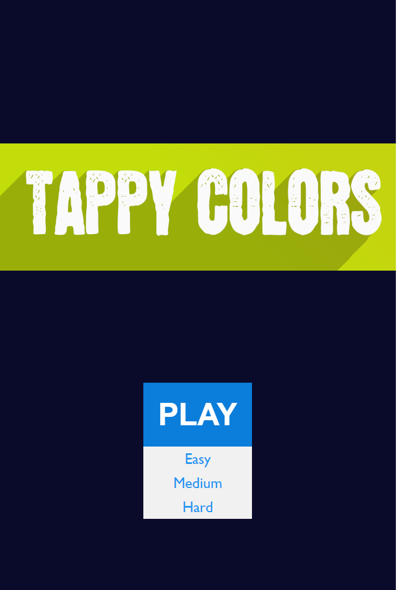

# Tappy Colors

Welcome to "Tappy Colors", an engaging and colorful web game that tests your reflexes and decision-making skills!

## Game Overview

"Tappy Colors" challenges players to deal with falling colored squares. The game's objective is straightforward yet captivating - let squares fall to the ground if their color matches the ground color, otherwise tap them to destroy them. Quick thinking and sharp reflexes are key to mastering "Tappy Colors".

## Features

- **Three Difficulty Levels**: Choose from Easy, Medium, or Hard to suit your skill level.
- **Vibrant Graphics**: Engage with an array of colorful squares that keep the gameplay visually stimulating.
- **Intuitive Gameplay**: Simple yet addictive game mechanics suitable for all ages.

## How to Play

1. **Start the Game**: Select your preferred difficulty level – Easy, Medium, or Hard.
2. **Observe the Falling Squares**: Watch as squares of different colors fall from the top of the screen.
3. **Match or Tap**: If the color of the falling square matches the ground, let it fall. If it doesn’t, tap the square to destroy it.
4. **Avoid Mistakes**: Making a wrong move or missing a square results in a loss. Stay focused!
5. **Score Points**: Successfully destroying mismatched squares or letting matched ones fall earns you points.
6. **Beat Your High Score**: Keep playing to beat your previous high scores.

## Difficulty Levels

- **Easy**: 3 channels of falling squares.
- **Medium**: 4 channels of falling square.
- **Hard**: 5 channels of falling square.

## Contributing

We love contributions! If you have ideas to improve the game, or have found a bug, please feel free to contribute.

## Feedback

Your feedback is important. If you have any comments or suggestions, please let us know.

Enjoy playing "Tappy Colors" and challenge yourself to achieve a new high score!
